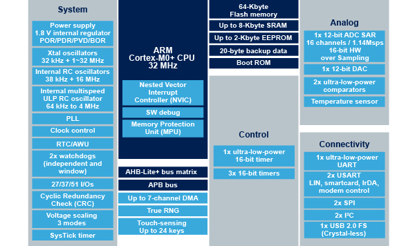

# [STM32L052](https://github.com/SoCXin/STM32L052)

#### [Vendor](https://github.com/SoCXin/Vendor)：[ST](https://github.com/SoCXin/ST)
#### [Core](https://github.com/SoCXin/Cortex)：[Cortex M0](https://github.com/SoCXin/CM0)
#### [Level](https://github.com/SoCXin/Level)：32MHz (0.95DMIPS/MHz)

### [简介](https://github.com/sochub/STM32L0/wiki)

[STM32L052](https://github.com/SoCXin/STM32L052)拥有低功耗性能

### [收录资源](https://github.com/SoCXin/STM32L052)

* [文档](docs/)
* [资源](src/)

### [选型建议](https://github.com/SoCXin)

[STM32L052](https://github.com/SoCXin/STM32L052)在低功耗产品中广泛应用

###  [SoC芯平台](http://www.SoC.Xin)
